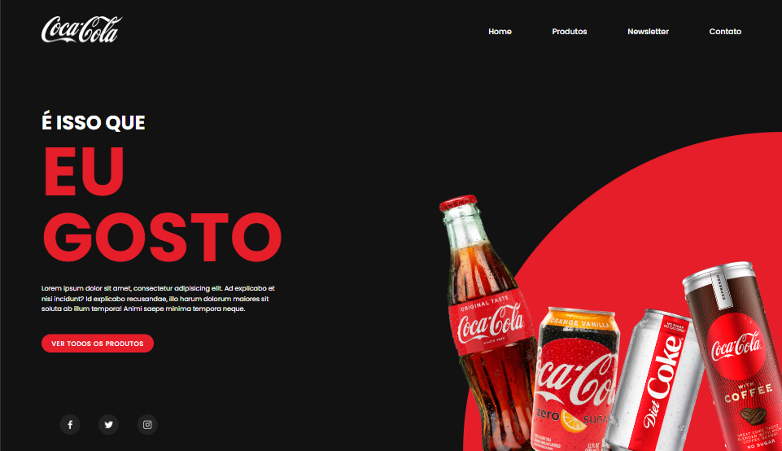

<h1 align="center">
  LandingPage - CocaCola Brasil
</h1>

  

## 💻 Projeto

Este projeto é um tutorial que ensina a como criar uma LandingPage da CocaCola **Coca Cola** ao usar _HTML_ e _CSS_.

## 🚀 Tecnologias

- HTML
- CSS

## 📔 Conhecimentos abordados

- [x] Uso semântico do HTML
- [x] Carregamento de Imagem
- [x] Uso do CSS Flexbox
- [x] Efeitos com a propriedade `transform` do css

## 📝 Tema de casa

- [ ] Criar responsividade
- [ ] Adicionar efeito de hover nos botões
